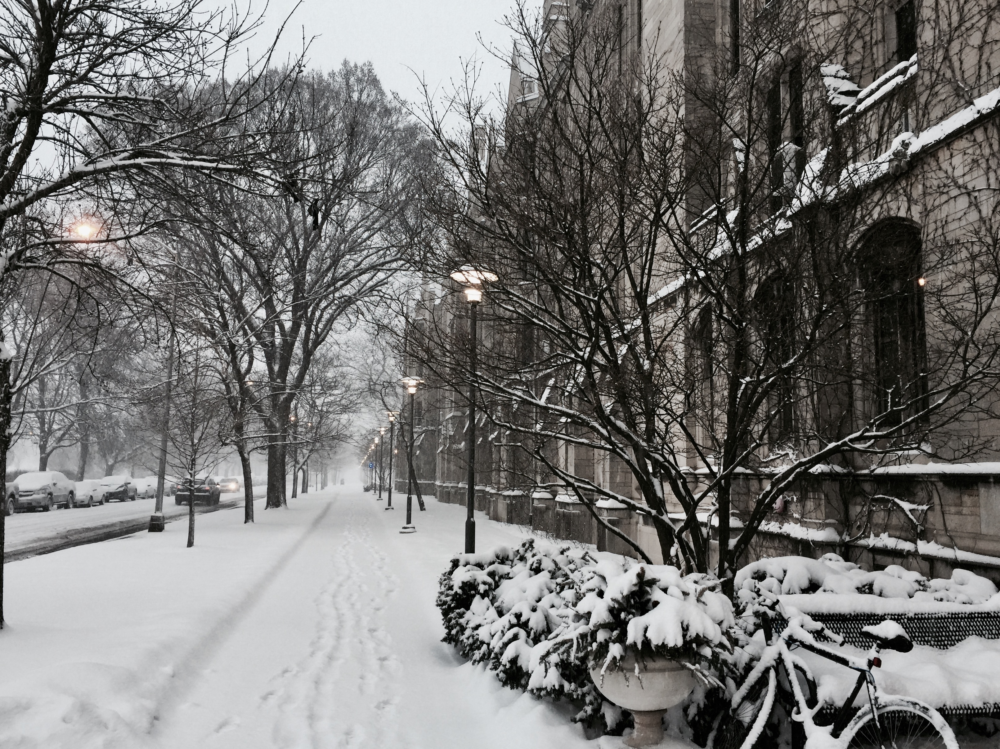

<a href="https://en.wikipedia.org/wiki/Burton–Judson_Courts" style="color: #940000">Here</a> is the Wiki page of Burton-Judson Courts, a place with unparalleled house culture. And here are my pictures. 

<!-- <html>
<head>

</head>
<body>

  

<h3>Objection to Hume’s Position on the Argumentative Circle</h3>

Richard Pang, in 2016

  

</body> -->
